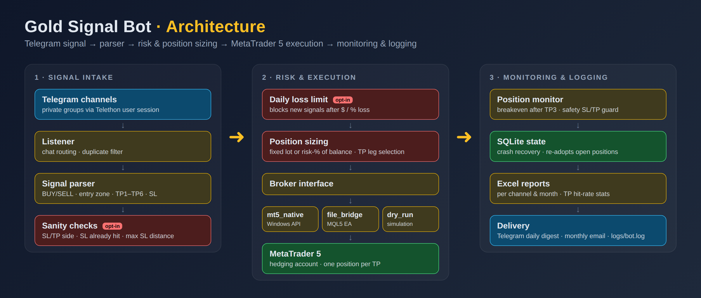
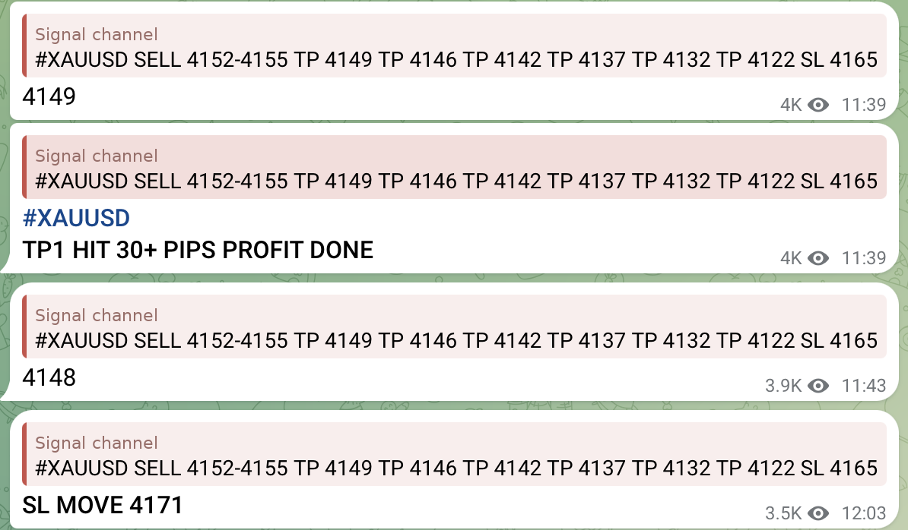
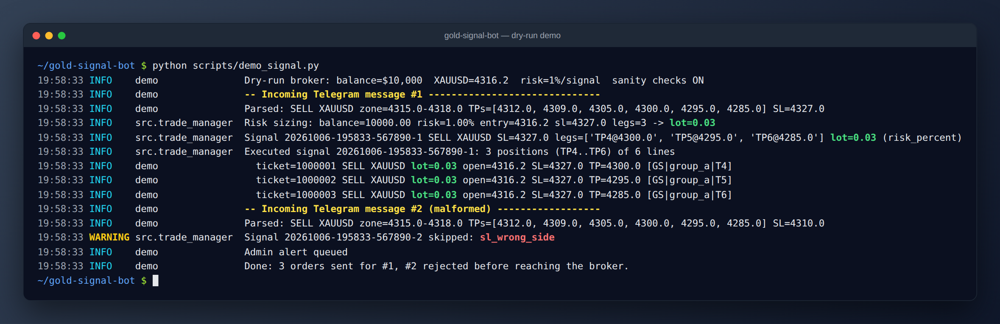
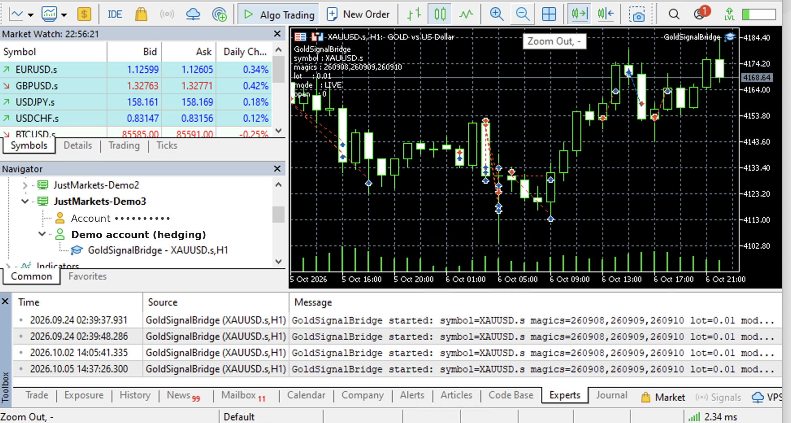
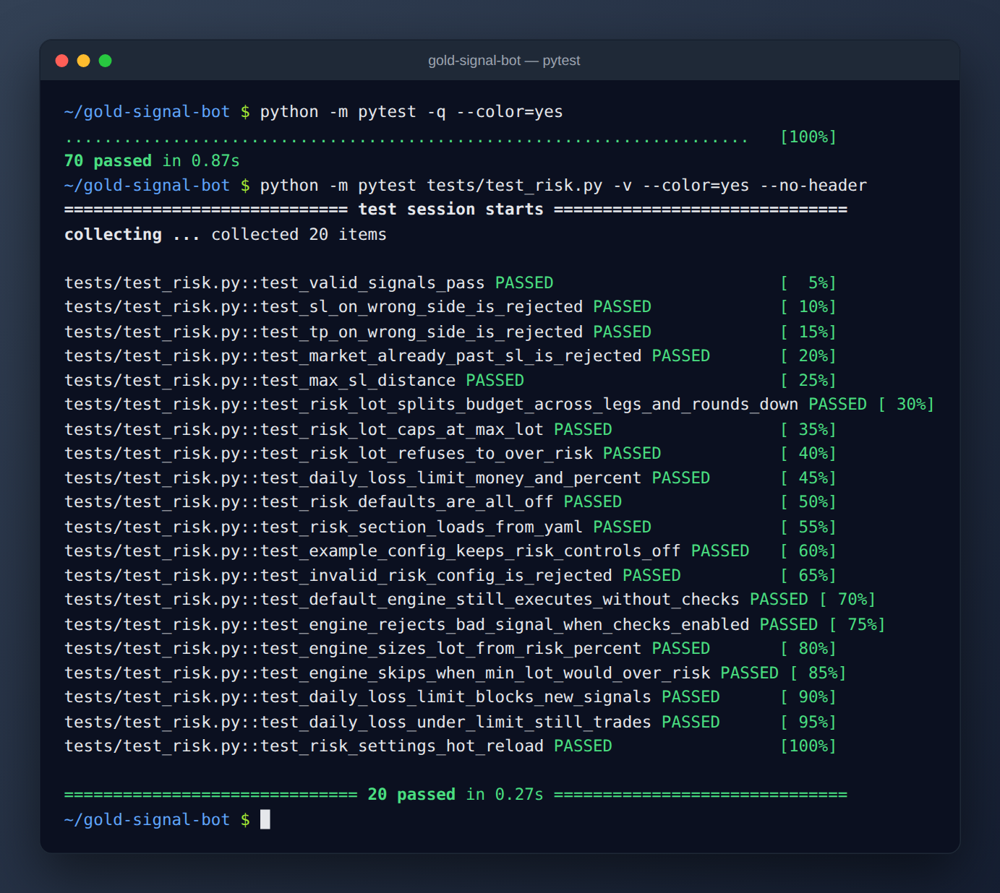
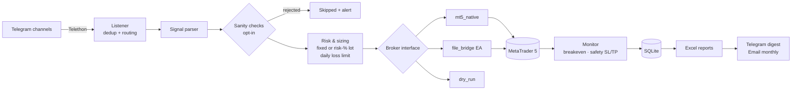

# Gold Signal Bot — Telegram → MetaTrader 5 Trade Executor

> Listens to Telegram signal channels, parses XAUUSD (gold) trade calls, and executes them on MetaTrader 5 within seconds. It sizes positions by risk, rejects malformed signals, manages stops, and logs every position to per-channel Excel reports.

[](https://github.com/aryOZby/gold-signal-bot/actions/workflows/tests.yml)




---

## Why it exists

Signal channels post trade calls faster than anyone can copy them by hand, and every second of delay costs pips. A manual copier also forgets to move stops, sizes positions inconsistently, and keeps no reliable track record. This bot covers the whole loop, from the message to the order to the report, with no human in it.

## Features

**Execution**
- **Real-time Telegram listening.** Uses a Telethon user session, so it reads private channels you're a member of. Channels can be identified by numeric ID or by `@username`.
- **Robust signal parser.** Supports two signal templates, tolerates Unicode dashes and spacing, and ignores chatter and duplicate messages.
- **Multi-leg orders.** Opens one market position per TP, all sharing the signal's SL. Each channel can skip the first N TPs, keep only the K farthest, and use its own lot size and magic number.
- **Three backends behind one `Broker` interface:**
  - `mt5_native` uses the official MetaTrader5 Python API on Windows.
  - `file_bridge` drives a custom MQL5 Expert Advisor, so it also works on macOS.
  - `dry_run` simulates trades for testing.

**Risk controls** (all opt-in; the defaults keep the original behaviour)
- **Risk-% position sizing.** Each signal risks a fixed share of the account balance, sized from the distance to the SL and split across the TP legs. Lots are rounded down to the lot step and capped by `max_lot`. If even the minimum lot would exceed the risk budget, the signal is skipped instead of over-risked.
- **Signal sanity checks.** A signal is rejected when its SL or TPs sit on the wrong side of the entry zone, when the market is already past the SL, or when the SL is farther than `max_sl_pips` from entry.
- **Daily loss limit.** No new signals are taken after today's realised loss reaches a money amount or a percentage of balance. Open positions are left alone.
- **Breakeven automation.** Once price touches TP3, every remaining stop moves to entry.
- **Safety guard.** A background loop checks every position. Any position that has no SL or TP 5 seconds after opening gets a 50-pip emergency SL/TP.

**Operations**
- **Crash-safe state.** SQLite stores signals and trades. After a restart, the bot finds its live positions again by magic number and trade comment.
- **Hot reload.** Changes to the lot size, strategy, risk settings, or the master trading switch in `config.yaml` apply within about 5 seconds, without a restart.
- **Reporting.** A live Excel workbook for each channel and month, plus a TP1–TP6 hit-rate sheet. A daily digest goes to Telegram and the monthly report goes out by email.
- **Tooling.** One-command Windows VPS installer, a Scheduled Task with auto-restart, a systemd unit, MT5 diagnostics, and a config linter.
- **CI.** GitHub Actions runs the 70-test suite on Python 3.11 and 3.12 for every push.

## See it work

### Incoming signal

A real signal thread from a Telegram channel (the channel name is hidden):



The quote previews collapse the original post onto one line. The bot reads the original multi-line message:

```text
#XAUUSD SELL 4152-4155

TP 4149
TP 4146
TP 4142
TP 4137
TP 4132
TP 4122

SL 4165
```

### Signal → risk check → orders (dry run)

`python scripts/demo_signal.py` runs a sample signal through the real engine with a simulated broker. It parses the signal, sizes the lot at 1% risk, and opens three TP legs. It then rejects a malformed signal whose SL sits on the wrong side.



### Running on a Windows VPS

MetaTrader 5 with the `GoldSignalBridge` Expert Advisor attached to XAUUSD. Account details are hidden.



### Test suite



## Architecture



| Module | Responsibility |
|---|---|
| `src/telegram_listener.py` | Telethon client, group resolution, message routing, admin alerts |
| `src/parser.py` | Turns raw message text into a typed `ParsedSignal` |
| `src/risk.py` | Sanity checks, risk-% lot sizing, daily loss limit (pure, unit-tested functions) |
| `src/trade_manager.py` | `TradingEngine`: queue, TP selection, execution, breakeven, safety guard, scheduler |
| `src/brokers/` | `Broker` ABC plus `mt5_native`, `file_bridge`, `dry_run` |
| `mt5/GoldSignalBridge.mq5` | MQL5 Expert Advisor for the file-bridge mode |
| `src/db.py` | SQLite persistence and crash recovery |
| `src/excel_report.py`, `src/stats.py` | Excel workbooks and TP hit-rate statistics |

## Tech stack

**Python 3.11+** · Telethon · MetaTrader5 (Python API) · MQL5 · SQLite · openpyxl · PyYAML · pytest · GitHub Actions · PowerShell / systemd

## Getting started

### Prerequisites

- Python 3.11+
- A Telegram account that is a member of the signal channels, plus an API ID and hash from [my.telegram.org](https://my.telegram.org)
- A MetaTrader 5 terminal logged in to a **hedging** account (start with a demo account)

### Local install

```bash
git clone https://github.com/aryOZby/gold-signal-bot.git
cd gold-signal-bot
python -m venv .venv
source .venv/bin/activate        # Windows: .venv\Scripts\activate
pip install -r requirements.txt
cp .env.example .env
cp config.example.yaml config.yaml
python -m pytest                   # 70 tests
python scripts/demo_signal.py      # offline demo, no Telegram/MT5 needed
python scripts/login_telegram.py   # one-time Telegram login
python scripts/list_chats.py       # find your channel IDs
python main.py                     # run (dry_run by default)
```

### Windows VPS (24/7)

```powershell
powershell -ExecutionPolicy Bypass -File scripts\vps\setup.ps1
# fill in .env and config.yaml (dry_run: false, broker.type: mt5_native)
.\.venv\Scripts\python.exe scripts\login_telegram.py
powershell -ExecutionPolicy Bypass -File scripts\vps\install-task.ps1
```

This registers a `GoldSignalBot` Scheduled Task that starts at logon and restarts on failure. MT5 must stay logged in during the same session.

## Configuration

### Environment variables (`.env`)

| Variable | Required | Description |
|---|---|---|
| `TELEGRAM_API_ID` / `TELEGRAM_API_HASH` | ✅ | From my.telegram.org → API development tools |
| `TELEGRAM_PHONE` | ✅ | Account phone in international format, used once at login |
| `TELEGRAM_ADMIN_CHAT_ID` | – | Chat that receives alerts and the daily digest |
| `MT5_LOGIN` / `MT5_PASSWORD` / `MT5_SERVER` | `mt5_native` | Leave empty to attach to the already-logged-in terminal |
| `MT5_TERMINAL_PATH` | – | Path to `terminal64.exe` if auto-discovery fails |
| `LOT_SIZE` | – | Default lot per TP leg (fixed mode) |
| `DRY_RUN` | – | `true` (default) means no real orders |
| `SMTP_*`, `EMAIL_FROM`, `EMAIL_TO` | – | Monthly email report. For Gmail, use an App Password |

See [`.env.example`](.env.example).

### Strategy (`config.yaml`)

| Key | Default | Meaning |
|---|---|---|
| `telegram.groups[].lot` | `0.01` | Lot per position, per channel (fixed mode) |
| `telegram.groups[].skip_first_tps` | `2` | Ignore the first N TP lines |
| `telegram.groups[].take_farthest_tps` | `3` | Trade only the K farthest remaining TPs |
| `telegram.groups[].breakeven_after_tp` | `3` | Move all stops to entry after this TP is touched |
| `trading.enabled` | `true` | Master switch, hot-reloaded |
| `trading.safety_pips` | `50` | Emergency SL/TP distance |
| `broker.type` | `dry_run` | `dry_run` · `mt5_native` · `file_bridge` |

### Risk controls (`config.yaml` → `risk:`)

| Key | Default | Meaning |
|---|---|---|
| `lot_mode` | `fixed` | `fixed` uses each group's `lot`; `risk_percent` sizes from balance |
| `risk_percent` | `1.0` | % of balance lost if the SL is hit, split across the TP legs |
| `min_lot` / `max_lot` / `lot_step` | `0.01` / `1.0` / `0.01` | Lot rounding and caps |
| `contract_value` | `100` | $ per 1.0 price move per lot, used only if the broker can't report it |
| `sanity_checks` | `false` | Reject wrong-side SL/TP and signals whose SL is already hit |
| `max_sl_pips` | `0` (off) | Reject signals with an SL farther than this from entry |
| `daily_loss_limit` | `0` (off) | Stop taking new signals after this realised loss today ($) |
| `daily_loss_limit_percent` | `0` (off) | Same, as % of the start-of-day balance |

Example: risk 0.5% per signal, reject bad signals, stop after a $200 losing day:

```yaml
risk:
  lot_mode: risk_percent
  risk_percent: 0.5
  max_lot: 0.5
  sanity_checks: true
  max_sl_pips: 200
  daily_loss_limit: 200
```

## Testing

```bash
python -m pytest              # parser, engine, risk, config, stats, Excel, email
python scripts/demo_signal.py # end-to-end dry run with risk sizing
python scripts/diag_mt5.py    # MT5 connection & symbol diagnostics (Windows)
```

## ⚠️ Disclaimer

This software is provided for **educational and personal-automation purposes only**. It is not financial advice. Trading leveraged instruments such as gold CFDs carries a high risk of losing more than your deposit. Signals from third-party channels can be wrong, delayed, or malicious, and automated execution can amplify losses through bugs, slippage, disconnects, or broker rejections. **Always run on a demo account first**, use position sizes you can afford to lose, and keep the safety guard and risk controls enabled. The author accepts no liability for any financial loss.

## License

[MIT](LICENSE)

---

<sub>Built by [aryOZby](https://github.com/aryOZby). Available for custom trading bots and automation projects. Contact: [ozary1764@gmail.com](mailto:ozary1764@gmail.com)</sub>
